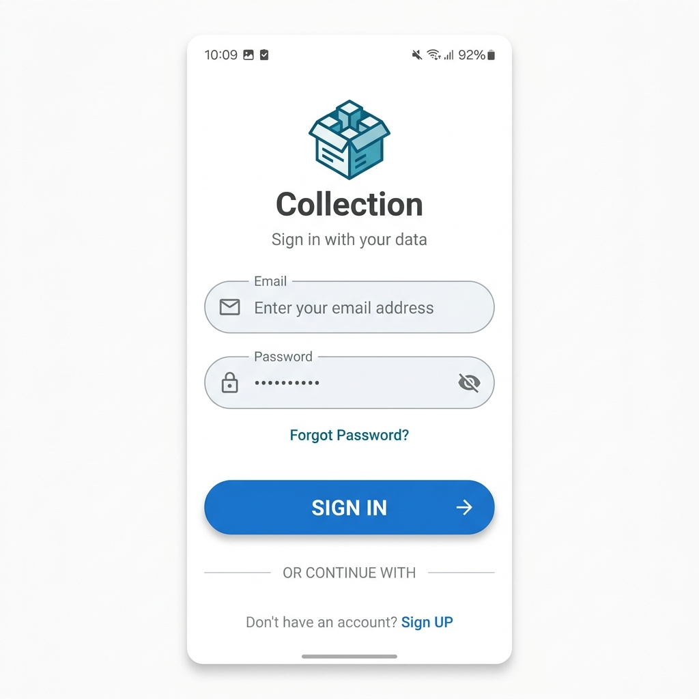
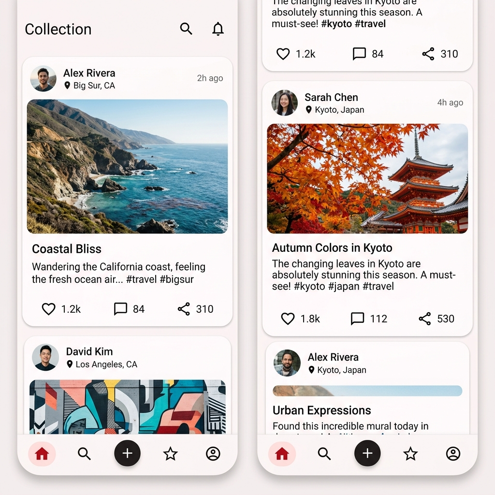
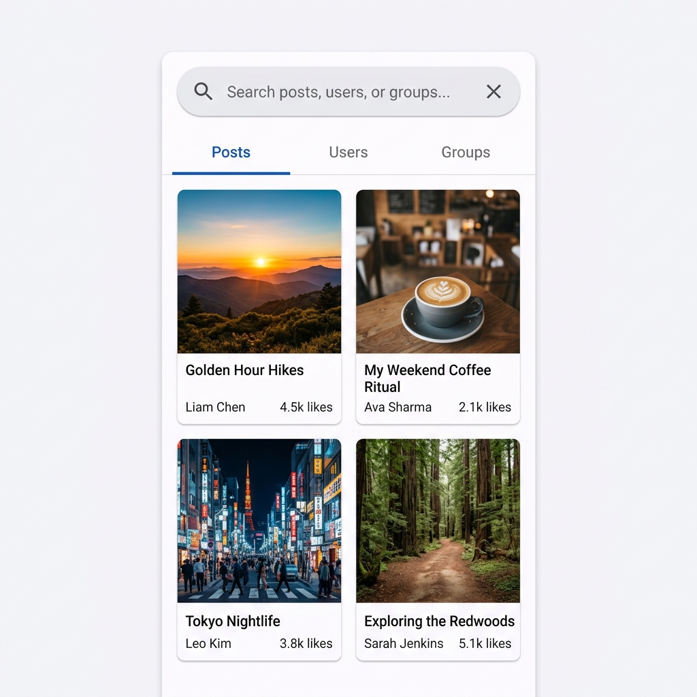
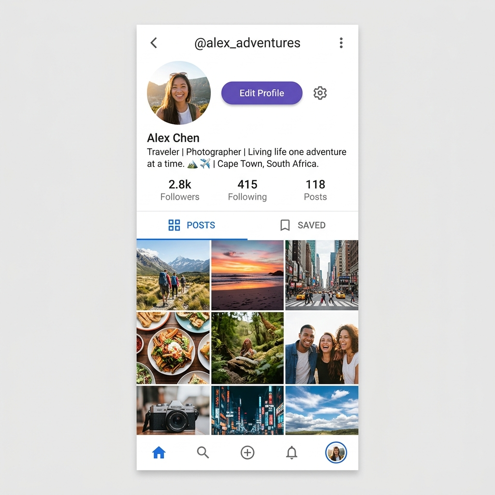
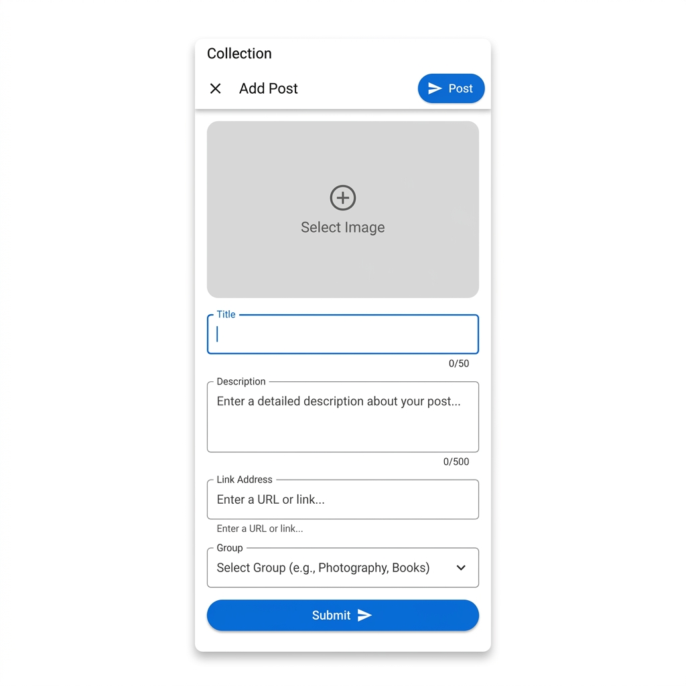
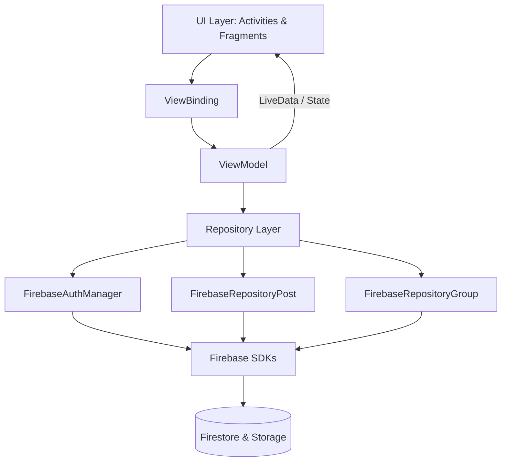
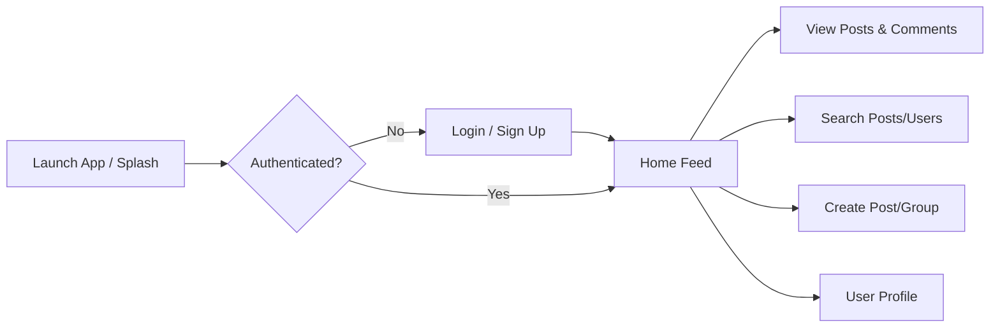

<div align="center">
  <h1>Collection</h1>
  <p><strong>A Modern Android Social Media Application for Sharing and Exploring Digital Collections</strong></p>
</div>

<p align="center">
  
  
  
  
  
</p>

## 🚀 Project Overview

**Collection** is a full-featured, native Android social media application built to let users share and organize visual posts into groups. It features a complete authentication flow, real-time social interactions (likes, comments, following), a dynamic feed, and robust search capabilities. 

Built entirely in **Kotlin** with a focus on modern Android development practices, the app uses **Firebase** for backend services and follows a clean **MVVM (Model-View-ViewModel)** architectural pattern.

**At a Glance:**
* **Project Type:** Native Android Application
* **Platform:** Android (Min SDK 26, Target SDK 34)
* **Architecture:** MVVM (Model-View-ViewModel) + Repository Pattern
* **Core Technologies:** Kotlin, XML/ViewBinding, Jetpack Navigation, Firebase (Auth, Firestore, Storage)

---

## ✨ Key Features

* **Authentication System:** Secure email/password login, registration, password recovery, and profile management powered by Firebase Auth.
* **Dynamic Feed & Posts:** Users can create posts with images, titles, descriptions, and external links. The home feed displays real-time updates.
* **Social Interactions:** 
  * Like and un-like posts.
  * Add and view comments on posts.
  * Follow and unfollow other users.
  * Dedicated tabs for "Favorites" (liked posts) and Follower/Following lists.
* **Groups/Collections:** Organize posts into specific groups. Users can create new groups and filter posts by group.
* **Advanced Search:** Multi-tabbed search functionality allowing users to seamlessly find specific **Posts**, **Users**, or **Groups**.
* **Profile Management:** Detailed user profiles showing statistics (followers, following) and user-specific post grids.
* **External Links:** Built-in support for securely opening web links via Chrome Custom Tabs.

---

## 🛠 Tech Stack

| Technology | Purpose |
| :--- | :--- |
| **Kotlin** | Primary programming language |
| **Android SDK** | Native Android framework |
| **ViewBinding** | Type-safe view interactions in Fragments/Activities |
| **Jetpack Navigation** | Single-Activity, Fragment-based navigation and routing |
| **ViewModel & LiveData** | Lifecycle-aware state management and UI observation |
| **Coroutines & Tasks** | Asynchronous operations and background threading |
| **Glide** | Efficient remote image loading and caching |
| **Firebase Auth** | Secure user authentication and management |
| **Firebase Firestore** | Real-time, scalable NoSQL cloud database |
| **Firebase Storage** | Cloud storage for user-uploaded images |

---

## 📐 Architecture

The application strictly adheres to the **MVVM (Model-View-ViewModel)** architecture combined with the **Repository Pattern**, ensuring a clean separation of concerns, testability, and maintainability.



* **UI Layer:** Activities (e.g., `MainActivity`, `LoginActivity`) and Fragments (`HomeFragment`, `SearchFragment`) observe data and handle user input.
* **ViewModel Layer:** E.g., `HomeViewModel`, `SearchViewModel`. Holds business logic, fetches data from repositories, and exposes it via `LiveData` to the UI.
* **Repository Layer:** E.g., `FirebaseRepositoryPost`. Encapsulates data fetching, abstracting away the complexity of Firestore queries and Storage uploads from the ViewModels.
* **Data Source:** Firebase (Firestore, Storage, Auth).

---

## 🔄 User Flow



---

## 📁 Project Structure

```text
app/src/main/java/com/example/project01/
├── activity/            # Entry points & Auth activities (MainActivity, LoginActivity, etc.)
├── adaptor/             # RecyclerView adapters (HomeAdaptor, SearchAdaptors)
├── dialogs/             # Custom UI dialogs
├── fragments/           # Core UI screens (HomeFragment, ProfileFragment, SearchFragment)
├── modal/               # Data models representing Firestore documents (HomeModal, UserModal)
├── repositoryfirebase/  # Firebase repository abstractions
└── viewmodal/           # ViewModels managing UI state
```

---

## 🚀 Setup & Installation

### Requirements
* Android Studio (Ladybug or latest recommended)
* JDK 17 (Java Version 1.8 compatibility configured)
* Android SDK (API Level 34)

### Installation Steps

1. **Clone the repository:**
   ```bash
   git clone <repository-url>
   cd SMApp
   ```

2. **Firebase Configuration:**
   * This project relies on Firebase. You must connect the app to a Firebase project.
   * Go to the Firebase Console, create a new project.
   * Enable **Authentication** (Email/Password), **Firestore Database**, and **Storage**.
   * Download the `google-services.json` file.
   * Place the `google-services.json` file into the `app/` directory of this project.

3. **Build and Run:**
   * Open the project in Android Studio.
   * Sync Project with Gradle Files.
   * Run the app on an emulator or physical device.

---

## 🔐 Security Notes

* Firebase security rules (Firestore and Storage) should be configured in the Firebase console to prevent unauthorized read/write access.
* Ensure your `google-services.json` is added to `.gitignore` to prevent exposing your Firebase configuration if you plan to make the repository public.
* The application currently manages database access via the client SDK using authenticated user IDs.

---

## 💡 Engineering Highlights

* **Clean Separation of Concerns:** Business logic is entirely decoupled from UI via ViewModels, making the codebase scalable.
* **Robust Repository Pattern:** All Firebase operations are abstracted into dedicated Repositories (`FirebaseRepositoryPost`, `FirebaseRepositoryGroup`), ensuring ViewModels do not directly depend on the database implementation.
* **Modern UI Implementation:** Extensive use of `ViewBinding` eliminates `findViewById` and prevents null pointer exceptions related to views.
* **Asynchronous Image Uploads:** Combines Kotlin Coroutines (`suspend` functions) and Firebase Tasks (`await()`) to handle complex operations like uploading an image, retrieving its download URL, and saving the post document in a clean, sequential manner.
* **Memory Efficient Image Loading:** Utilizes the Glide library for highly optimized, cached image rendering in scrolling lists.

---

**Author:** Abhishek Lacheta  
[GitHub Profile](https://github.com/Abhishek-lacheta)
